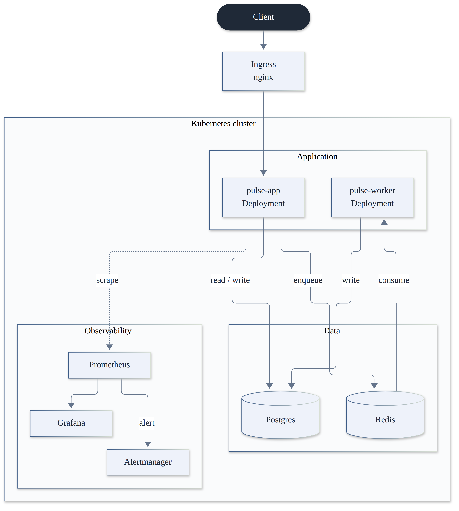

# pulse-platform

pulse-platform is a small FastAPI service deployed and operated like a real production system. The app itself is intentionally simple. The point is everything around it: containers, Kubernetes, CI/CD, observability with SLOs, load and chaos testing, and infrastructure as code.

## Architecture



A client request passes through an Ingress to the FastAPI app, which reads and writes Postgres directly and enqueues background work on Redis. A separate worker consumes that queue and writes results back to Postgres. Prometheus scrapes the app's metrics, Grafana visualizes them, and Alertmanager fires when either SLO is breached.

## Quick start

Requires Docker.

```bash
git clone https://github.com/jessechumo/pulse-platform.git
cd pulse-platform
docker compose up -d --build
docker compose exec app alembic upgrade head
```

```bash
curl localhost:8000/health
curl localhost:8000/ready
curl -X POST localhost:8000/jobs -H "Content-Type: application/json" -d '{}'
```

Stop everything with `docker compose down`.

### Run the app without Docker

Postgres and Redis still run in containers; the app runs on the host for fast iteration.

```bash
python3 -m venv .venv && source .venv/bin/activate
pip install -r requirements-dev.txt
docker compose up -d postgres redis
cp .env.example .env
alembic upgrade head
uvicorn app.main:app --reload
```

### Tests

```bash
pytest -m "not integration"   # no external services needed
pytest                        # full suite, needs postgres and redis running
```

## What this project demonstrates

- FastAPI service with liveness and readiness probes, structured JSON logging, and Prometheus metrics
- Postgres schema managed with Alembic migrations, Redis backed background jobs via arq
- Kubernetes manifests, both raw and packaged as a Helm chart: Deployments, HPA, Ingress, ConfigMaps, Secrets
- Prometheus and Grafana via kube-prometheus-stack, a custom dashboard, and two SLO backed alerts
- GitHub Actions CI: lint, test against real Postgres and Redis, Docker build, Trivy image scan
- Terraform for an equivalent AWS environment: VPC, EKS, RDS
- Load testing with Locust and chaos experiments for pod and database failures

## Kubernetes

Local cluster with kind:

```bash
kind create cluster --config k8s/kind/kind-config.yaml
kubectl apply -f https://raw.githubusercontent.com/kubernetes/ingress-nginx/controller-v1.11.3/deploy/static/provider/kind/deploy.yaml
kubectl wait --namespace ingress-nginx --for=condition=ready pod --selector=app.kubernetes.io/component=controller --timeout=120s

docker build -t pulse-platform:dev .
kind load docker-image pulse-platform:dev --name pulse-platform
kubectl apply -f k8s/
kubectl apply -f k8s/jobs/migrate-job.yaml
kubectl wait --for=condition=complete job/pulse-migrate -n pulse --timeout=60s

curl localhost/health
```

kind does not ship `metrics-server`, so the HPAs will not report CPU usage until it is installed separately.

Or with Helm, which runs migrations automatically as a pre-install and pre-upgrade hook:

```bash
helm install pulse k8s/helm/pulse-platform --namespace pulse --create-namespace
```

### Observability

```bash
helm repo add prometheus-community https://prometheus-community.github.io/helm-charts
helm install observability prometheus-community/kube-prometheus-stack \
  --namespace observability --create-namespace \
  -f k8s/observability/kube-prometheus-stack-values.yaml
kubectl apply -f k8s/observability/
```

Two SLOs are enforced as Prometheus alerts: 99.5% availability and p95 latency under 300ms.

### Load testing and chaos

```bash
pip install locust
locust -f loadtest/locustfile.py --host http://localhost:8000

loadtest/chaos/kill-app-pod.sh
loadtest/chaos/kill-postgres.sh
```

## Terraform

Provisions an equivalent environment on AWS: VPC, EKS, RDS. Meant to be applied once for evidence it works, then destroyed. See [docs/runbooks/terraform-apply-destroy.md](docs/runbooks/terraform-apply-destroy.md) for cost estimates and the full walkthrough.

```bash
cd terraform
terraform init
terraform plan
```

## Repo layout

```
app/          FastAPI service
tests/        Unit and integration tests
k8s/          Kubernetes manifests and Helm chart
terraform/    AWS infrastructure as code
loadtest/     Locust load tests and chaos experiments
docs/         Architecture diagram and runbooks
```

Runbooks live in [docs/runbooks](docs/runbooks): on-call response and Terraform apply and destroy.

## Notable decisions

- `/health` and `/ready` are separate. Liveness says the process is alive; readiness says it can serve traffic, which is what lets Kubernetes pull a pod out of rotation without restarting it.
- Redis being unreachable at startup no longer crashes the app. It used to: the job queue's connection check at boot propagated and killed the process, defeating the entire point of having a readiness probe.
- `pulse-app` and `pulse-worker` have no `replicas` field. Once an HPA targets a Deployment, a hardcoded replica count just fights it on every apply.
- `jobs.payload` and `jobs.result` are `jsonb`, not `json`. Postgres's plain `json` type has no equality operator, so you cannot even query a row by its exact content.
- Third party GitHub Actions are pinned by commit SHA, not a version tag, since a tag can be repointed at different code later. First party actions stay tag pinned.
- Prometheus only scrapes ServiceMonitors created by its own Helm release unless `serviceMonitorSelectorNilUsesHelmValues` is set to false. Easy to miss, and this app's metrics would otherwise silently never get scraped.
- Nothing runs database migrations automatically. A completed Kubernetes Job cannot be reapplied, so the raw manifest path uses a manual step while the Helm chart runs migrations as a hook instead.
- Prometheus metrics are keyed by route template, not raw request path, to keep label cardinality bounded.
